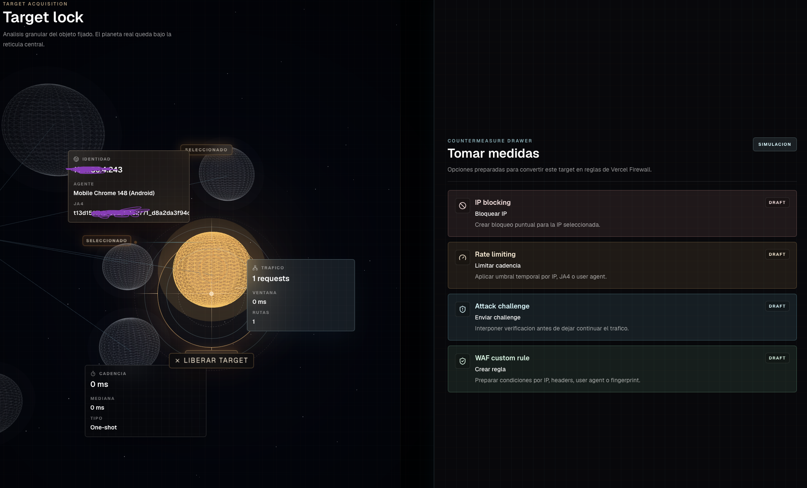
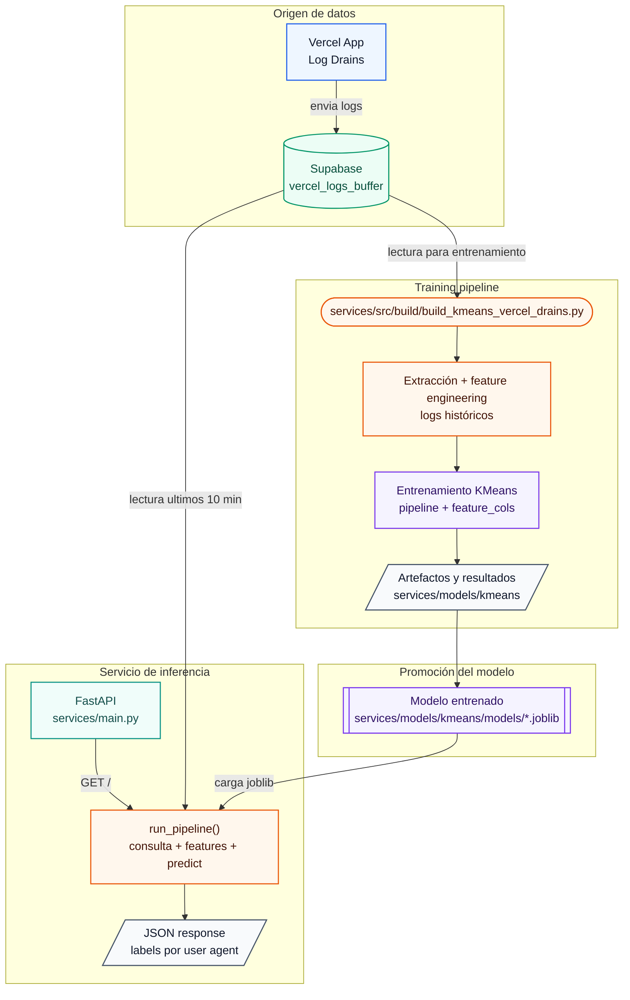
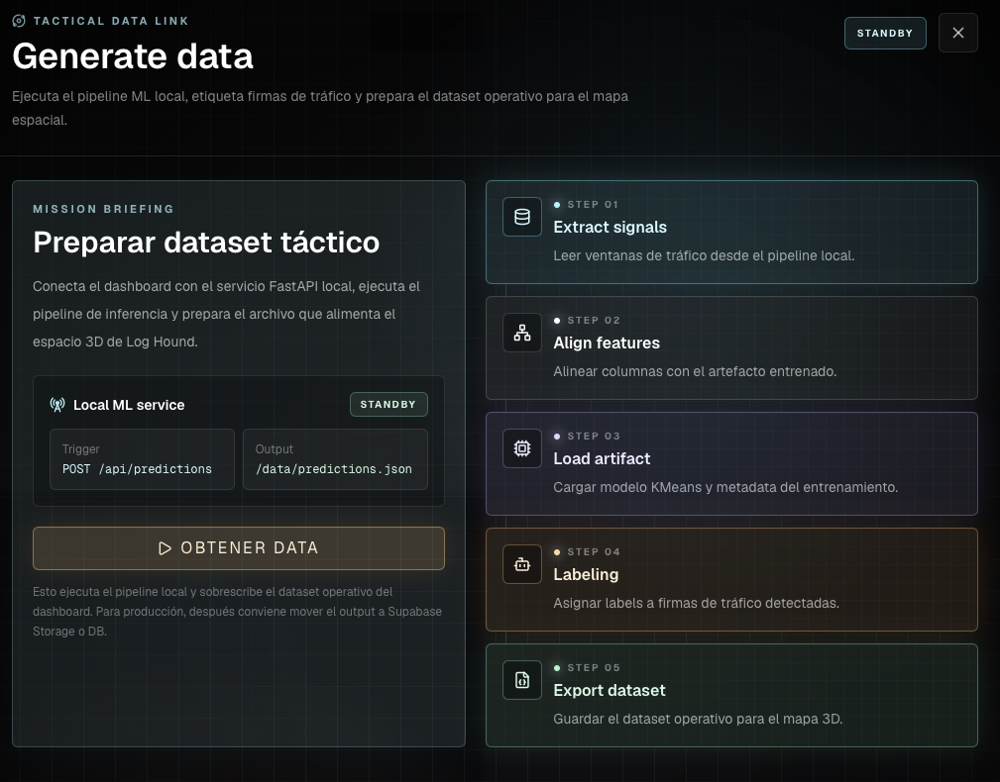
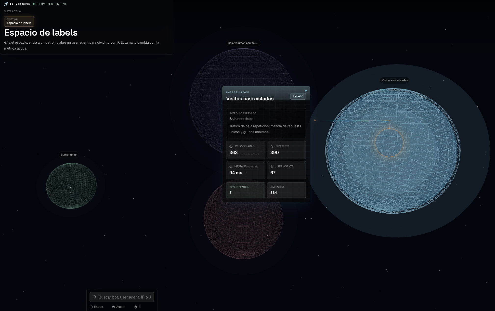

# LogHound

El problema de los userAgents cuando tienes un dominio con funciones serverless es consumir CPU time (incluso con L1 cache) de forma descontrolada. Si bien el cache y usar reglas de firewall mitigan fuertemente este problema, decidí crear una tool que permitiese a usuarios de Vercel tener un pipeline que les ayude a tunear sus reglas de firewall, clasificando a cada userAgent de acuerdo a su comportamiento (hacerlo a mano no es divertido en 100k registros).

Este repo busca presentar una arquitectura sencilla, pero efectiva haciendo delivery hacia un endpoint en fastApi, donde el único requerimento será tener tus log drains de Vercel configurados y siendo almacenados en una base de datos en Supabase (sorry ahi tengo mi infra).



## Requerimentos

- Conexión de Supabase y variables de entorno (SUPABASE_URL) y (SUPABASE_KEY)
- FASTAPI_URL=http://xyz.0.0.1:8000 esta configurada al puerto estandard
- Proyecto de Next.JS para la interface (En este momento solo es el código fuente)
- Requerimentos de Librerias se puede revisar en .requeriments

## Update 17 jun 2026

He estado trabajando en robusteser el dashboard, aun restan ideas por integrar. El punto más importante, estoy valorando mejorar el modelo fundacional utilizando mas a fondo los hash JA4 y además revalorar la ventana de entrenamiento. En este momento no es recomendable utilizarlo para tomar acción, requiere agrupamiento de ventanas de 10 minutos y ajustar algunas variabels durante el Feature Engineering.

## Arquitectura del sistema



## Cómo usar:

### Entrenamiento

El pipeline que construye el entrenamiento completo vive en:

```bash
services/src/build/build_kmeans_vercel_drains.py
```

Debe ejecutarse desde la carpeta `services`, porque el script usa `Path.cwd()` para resolver `src` y `models`, esto esta diseñado para ejecutar manualmente:

```bash
cd services
python3.11 src/build/build_kmeans_vercel_drains.py
```

Este flujo:

1. Pregunta si debe descargar fresh data desde Supabase.
2. Si se responde que si, extrae logs desde la tabla indicada, normaliza el campo `log`, limpia el payload y guarda un parquet de entrenamiento.
3. Si se responde que no, reutiliza un parquet existente en `services/models/kmeans/data`.
4. Construye features agrupadas por `ja4Digest`, `proxy.userAgent` y `proxy.clientIp`.
5. Crea metadata de preprocesamiento.
6. Entrena un pipeline `ColumnTransformer + KMeans`.
7. Guarda checkpoints, labels exploratorias y el artefacto `.joblib`.

Las salidas quedan en:

```txt
services/models/kmeans/data/
services/models/kmeans/checkpoints/
services/models/kmeans/results/
services/models/kmeans/models/
```

Despues de cada reentrenamiento conviene revisar `services/models/kmeans/results/labeled_frame.csv`. Las labels de KMeans pueden cambiar entre entrenamientos, por lo que el siguiente paso natural es agregar una etapa post-training que genere un reporte de interpretabilidad: resumen por label, tamaño de clusters, top user agents y ejemplos representativos para decidir si el modelo se acepta o se vuelve a entrenar.

Preferentemente debe entrenarse con una ventana historica amplia, por ejemplo data de 24 horas, para que los clusters tengan suficiente variacion de comportamiento.

### Nota

Necesita aún crear visualización para revisión de etiquetas y descripciones de como Kmeans ha organizado las labels
También hay una deuda actual técnica sobre variables del Feature Engineering, es menor, pero incrementa el size de los archivos.

### Servicio FastAPI

Este levanta un endpoint de FastAPI (aún sin integraciones de seguridad) para clasificar en periodos de 10 minutos user agents desde la misma base de datos de logdrains en supabase, en este momento esta disponible un modelo entrenado con datos de 100k registros de logs aunque este tenderá a causar covariance shift dado que los crawlers cambian cada n periodo de tiempo, de ahi la razón de un pipeline de reentrenamiento.

El flujo de inferencia vive en:

```txt
services/main.py
services/src/run_pipeline.py
services/src/utils/etl.py
```

next_interface

La interface de LogHound permite leer los últimos 10 minutos de datos desde supabase almacenando vercel log drains a traves del servicio principal de endpoint de FastAPI, almacena en data y posteriormente puede inicializarce la interfaz.

También la nueva versión permite bloquear reglas de firewall en producción con SDK aún faltan correcciones de ux/ui sin embargo ya se administra el log de reglas de firewall y permite consumir y tener observabilidad en 10 minutos en userAgents.





### Estado de `production_pipeline`

`production_pipeline/` ya no es el pipeline principal de entrenamiento. El entrenamiento real fue movido/consolidado en `services/src/build/build_kmeans_vercel_drains.py`.

En el estado actual, `production_pipeline/main.py` funciona como scorer batch legacy: carga un modelo ya entrenado, predice una ventana reciente y genera CSVs en `production_pipeline/results`. Puede seguir sirviendo para validaciones offline o auditoria rapida, pero duplica parte del flujo que ya existe en `services/src` y no debe tratarse como la fuente principal del sistema.

Si se mantiene, conviene dejarlo claramente como herramienta auxiliar. Si no se va a usar para validacion batch, puede considerarse obsoleto.

## Importante

En este momento la interface de Next esta pensada para almacenar el archivo en /public/data y consumir el archivo. También tiene una interface en interface/interface_main.py
que no es sexy pero es útil usando streamlit.

También esta abierto a discusión usar un modelo de train de 24 horas en una ventana en producción de 10 minutos. Aunque en pruebas, el modelo ha clasificado correctamente a los agents, particularmente por que la etiqueta 2 (user Agents) suele en msno de 10 minutos reflejar crawlers que navegan agresivamente en la web sobre la media de 42 requests.

## Lectura actual del modelo

La siguiente tabla resume cómo el modelo KMeans está separando los user agents en el artefacto actual. Es una lectura operacional hecha desde `Notebooks/06_check.ipynb` sobre los promedios por label: las etiquetas no son clases supervisadas, sino grupos de comportamiento que deben revisarse cuando se reentrene el modelo.

| Label | Patrón observado                | Requests | Ventana de actividad ms | Mean entre requests ms | Median entre requests ms | One shot | Lectura práctica                                                                      |
| ----- | ------------------------------- | -------: | ----------------------: | ---------------------: | -----------------------: | -------: | ------------------------------------------------------------------------------------- |
| 0     | Visitas casi aisladas           |     1.54 |                    0.96 |                   0.92 |                     0.92 |     0.59 | Tráfico de baja repetición; mezcla de requests únicos y grupos mínimos.               |
| 1     | Alto volumen sostenido          |    94.11 |           66,997,165.95 |             625,832.44 |               625,832.44 |     0.00 | Candidato fuerte a crawler agresivo o agente automatizado con muchas rutas visitadas. |
| 2     | Burst rápido de varias requests |     6.89 |            6,960,330.78 |                  94.05 |                    94.05 |     0.00 | Varias requests con separación muy corta; útil para detectar actividad concentrada.   |
| 3     | Bajo volumen con pausa larga    |     3.27 |           11,472,758.51 |           3,429,376.49 |             3,429,376.49 |     0.00 | Pocas requests repartidas en una ventana amplia; comportamiento menos agresivo.       |

Para la interpretabilidad se usa el promedio por label de forma intencional: en este caso conviene que los outliers afecten la lectura porque vuelven más obvios los grupos extremos, especialmente los agentes de alto volumen y las ventanas temporales largas. La mediana sigue siendo útil como lectura robusta, pero puede ocultar parte de esa separación operacional.

En el estado actual `conteo_requests`, `times_timestamp`, `request_amount` y `routes_visited` tienden a moverse juntos, por eso la lectura principal sale de volumen, ventana de actividad y tiempo entre requests. El `Unnamed: 0` del resumen anterior venía del índice guardado en CSV y fue eliminado al exportar `labeled_frame.csv` sin índice.

## Próximos pasos

En este momento el proyecto se mantendra en standby, sin embargo implementar reglas sobre los user agents clasificados sería una gran adición para refinar las reglas de firewalls e impactar la toma de desiciones sobre el firewall, en este momento la clasificación es úitl, pero nutrir con una capa de reglas o volver a clusterizar este grupo nos puede brindar reglas semiautomatizadas que ayudarian fuertemente a agilizar la detección de tráfico de userAgents no deseados y de baja constribución a proyectos.

También es importante mencionar que se pueden mejorar las Features ya que en Transponse algunas son redundantes.

El modelo proporcionado esta entrenado bajo 100k registros de userAgents reales, esta centrado el entrenamiento en comprotamiento, por lo que j4Digest, IP y el naming no afectan al rendimiento del modelo.

También esta es la última versión pública. El repo de producción se mantendra privado por SCLFox y posiblemente ya no reciba soporte.

Para finalizar se agrego una función para anonimizar data si alguien quiere montar un showcase. en services/src/build/utils/anonymize_data.py
