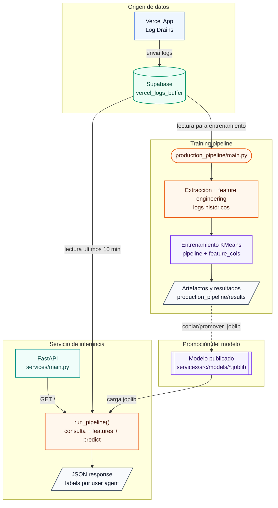

# Beta from PIDA

El problema de los userAgents cuando tienes un dominio con funciones serverless es consumir CPU time (incluso con L1 cache) de forma descontrolada. Si bien el cache y usar reglas de firewall mitigan fuertemente este problema, decidí crear una tool que permitiese a usuarios de Vercel tener un pipeline que les ayude a tunear sus reglas de firewall, clasificando a cada userAgent de acuerdo a su comportamiento (hacerlo a mano no es divertido en 100k registros).

Este repo busca presentar una arquitectura sencilla, pero efectiva haciendo delivery hacia un endpoint en fastApi, donde el único requerimento será tener tus log drains de Vercel configurados y siendo almacenados en una base de datos en Supabase (sorry ahi tengo mi infra), es vital mencionarlo ya que este repo hace uso de su libreria de python para la extracción de datos.

## Requerimentos

- Conexión de Supabase y variables de entorno (SUPABASE_URL) y (SUPABASE_KEY)
- Proyecto de Next.JS para la interface (En este momento solo es el código fuente)
- Requerimentos de Librerias se puede revisar en .requeriments

## Cómo usar:

production/pipeline/main.py

Este archivo conecta a la base de datos en postgress hacia la tabla que almacena los logdrains desde Vercel y entrena un modelo de KMEANS con esa data idealmente de 24 horas.
El entrenamiento actual prioriza, tiempo medio de requests, número de requests y combinación j4digest por lo que no funcionará optimo si se enmascara con Cloudflare.
Este modelo deberá almacenarse en /services/src/models.

### Nota

Necesita aún crear visualización para revisión de etiquetas y descripciones de como Kmeans ha organizado las labels
También hay una deuda actual técnica sobre variables del Feature Engineering, es menor, pero incrementa el size de los archivos.

services/main.py

Este levanta un endpoint de FastAPI (aún sin integraciones de seguridad) para clasificar en periodos de 10 minutos user agents desde la misma base de datos de logdrains en supabase, en este momento esta disponible un modelo entrenado con datos de 100k registros de logs aunque este tenderá a causar covariance shift dado que los crawlers cambian cada n periodo de tiempo, de ahi la razón de un pipeline de reentrenamiento.

## Importante

En este momento la interface de Next esta pensada para almacenar el archivo en /public/data y consumir el archivo. También tiene una interface en interface/interface_main.py
que no es sexy pero es útil usando streamlit.

También esta abierto a discusión usar un modelo de train de 24 horas en una ventana en producción de 10 minutos. Aunque en pruebas, el modelo ha clasificado correctamente a los agents, particularmente por que la etiqueta 2 (user Agents) suele en msno de 10 minutos reflejar crawlers que navegan agresivamente en la web sobre la media de 42 requests.

## Arquitectura del sistema

## Lectura actual del modelo

La siguiente tabla resume cómo el modelo KMeans está separando los user agents en el artefacto actual. Es una lectura operacional de los centroides: las etiquetas no son clases supervisadas, sino grupos de comportamiento que deben revisarse cuando se reentrene el modelo. (Necesita implementación)

| Label | Patrón observado                     | Requests | Ventana de actividad ms | Mediana entre requests ms | One shot | Lectura práctica                                                                      |
| ----- | ------------------------------------ | -------: | ----------------------: | ------------------------: | -------: | ------------------------------------------------------------------------------------- |
| 0     | Request único                        |        1 |                       0 |                         0 |        1 | Visita aislada o agente sin repetición en la ventana.                                 |
| 1     | Bajo volumen con separación moderada |        3 |                44,768.5 |                     6,279 |        0 | Actividad ligera, probablemente navegación o crawler poco agresivo.                   |
| 2     | Alto volumen                         |       49 |              44,582,656 |                     2,037 |        0 | Candidato fuerte a crawler agresivo o agente automatizado con muchas rutas visitadas. |
| 3     | Burst corto                          |        6 |                 2,566.5 |                         0 |        0 | Varias requests concentradas en muy poco tiempo.                                      |

En el estado actual `conteo_requests`, `times_timestamp`, `request_amount` y `routes_visited` tienden a moverse juntos, por eso la lectura principal sale de volumen, ventana de actividad y tiempo entre requests. `Unnamed: 0` aparece en el resumen del artefacto, pero debe tratarse como columna técnica/índice mientras se limpia esa deuda del feature engineering.

## Próximos pasos

En este momento el proyecto se mantendra en standby, sin embargo implementar reglas sobre los user agents clasificados sería una gran adición para refinar las reglas de firewalls e impactar la toma de desiciones sobre el firewall, en este momento la clasificación es úitl, pero nutrir con una capa de reglas o volver a clusterizar este grupo nos puede brindar reglas semiautomatizadas que ayudarian fuertemente a agilizar la detección de tráfico de userAgents no deseados y de baja constribución a proyectos.
