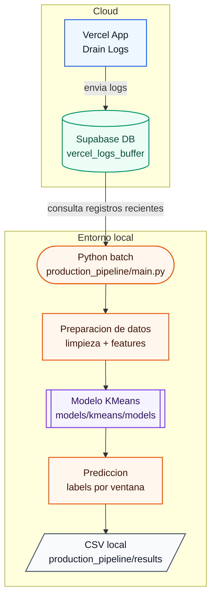

# Beta from PIDA

El problema de los userAgents cuando tienes un dominio con funciones serverless es consumir CPU time (incluso con L1 cache xc) de forma descontrolada. Si bien el cache y usar reglas de firewall mitigan fuertemente este problema, decidí crear una tool que permitiese a usuarios de Vercel tener un pipeline que les ayude a tunear sus reglas de firewall, clasificando a cada userAgent de acuerdo a su comportamiento (hacerlo a mano no es divertido en 100k registros).

Este repo (En revisión sorry) busca presentar una arquitectura sencilla, pero efectiva haciendo delivery hacia un endpoint en fastApi, donde el único requerimento será tener tus log drains de Vercel configurados y siendo almacenados en una base de datos en Supabase (sorry ahi tengo mi infra), es vital mencionarlo ya que este repo hace uso de su libreria de python para la extracción de datos.

## Arquitectura del sistema LOCAL

En beta, ha sido actualizada desde la subida anterior, pero dados los tiempos de revisión del ITESM es necesario mantener el proyecto final en hold.

## Competencias cubiertas

- Fundamentos de Ciencia de Datos
- Procesamiento de Datos
- Visualización de Datos
- Geovisualizació
- Diseño de interfaces
- Data Story
- Análisis de Datos
- Aprendizaje no supervisado

### Nota

El código fuente del proyecto se encuentra aún bajo revisión.
