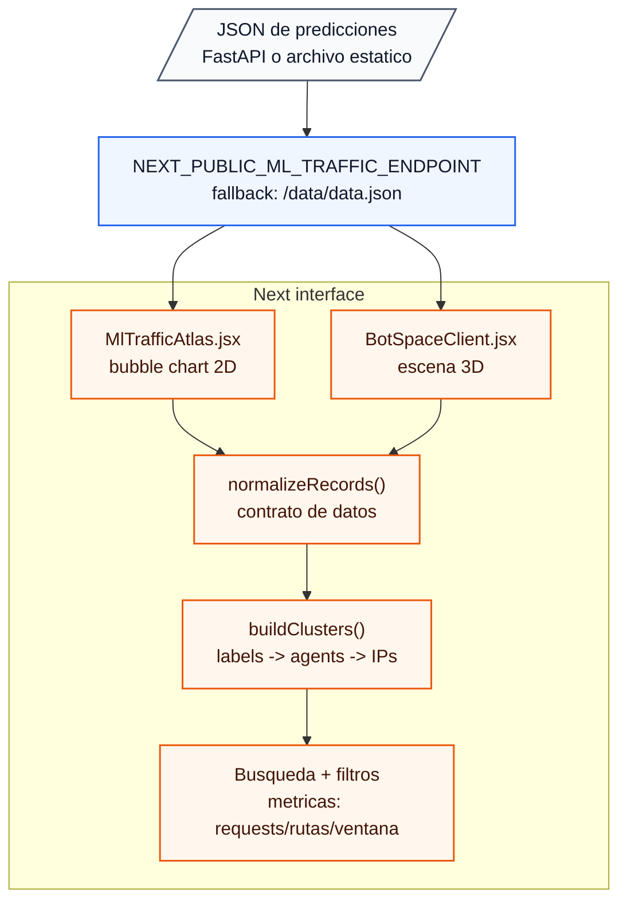
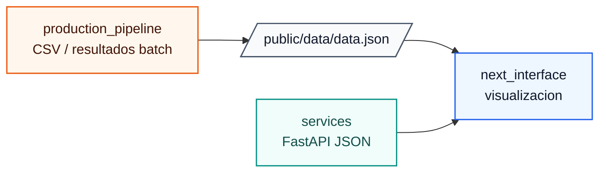

# PIDA Next Interface

Codigo fuente experimental para visualizar labels de comportamiento generadas por el pipeline ML.

Este directorio no contiene una aplicacion Next.js completa. Es una capa de interfaz portable, pensada para copiarse o integrarse dentro de una app Next existente. En esta etapa funciona como showcase in progress para explorar resultados del modelo antes de cerrar integracion, autenticacion, layout final y consumo directo del servicio.

## Estado

In progress.

La interfaz ya contiene componentes funcionales para cargar un JSON de predicciones y explorarlo visualmente, pero aun no representa una integracion final de producto.

## Que incluye

```txt
next_interface/
└── ml/
    ├── page.jsx
    ├── MlTrafficAtlas.jsx
    └── space/
        ├── page.jsx
        └── BotSpaceClient.jsx
```

| Archivo | Rol |
| --- | --- |
| `ml/page.jsx` | Pagina Next para montar el atlas 2D. |
| `ml/MlTrafficAtlas.jsx` | Explorador 2D con bubble chart, filtros y panel de detalle. |
| `ml/space/page.jsx` | Pagina Next para montar la vista 3D. |
| `ml/space/BotSpaceClient.jsx` | Explorador 3D con Three.js, orbit controls y drill-down por label, user agent e IP. |

## Rutas esperadas

Si se copia dentro de una app Next con App Router, las rutas esperadas serian:

```txt
/ml
/ml/space
```

La ruta `/ml` muestra el atlas 2D.

La ruta `/ml/space` muestra la exploracion 3D.

## Flujo de datos



## Contrato del JSON

Los componentes esperan una lista de registros. Puede venir desde `services/main.py` o desde un archivo estatico en `public/data/data.json`.

Ejemplo conceptual:

```json
[
  {
    "ja4Digest": "...",
    "proxy.userAgent": "Mozilla/5.0 ...",
    "proxy.clientIp": "0.0.0.0",
    "label": 2,
    "conteo_requests": 49,
    "times_timestamp": 49,
    "request_amount": 49,
    "routes_visited": 49,
    "activity_window_ms": 44582656,
    "mean_time_between_requests_ms": 2037,
    "median_time_between_requests_ms": 2037,
    "is_one_shot": false
  }
]
```

Campos principales:

| Campo | Uso en UI |
| --- | --- |
| `label` | Cluster asignado por el modelo. |
| `ja4Digest` | Busqueda y detalle tecnico del agente. |
| `proxy.userAgent` | Nombre legible, agrupacion por agente y busqueda. |
| `proxy.clientIp` | Drill-down por IP y detalle. |
| `conteo_requests` / `request_amount` | Metrica de volumen. |
| `routes_visited` | Metrica de rutas. |
| `activity_window_ms` | Metrica de ventana temporal. |
| `mean_time_between_requests_ms` | Detalle temporal. |
| `median_time_between_requests_ms` | Detalle temporal. |
| `is_one_shot` | Filtro entre visitas aisladas y recurrentes. |

## Configuracion de endpoint

Ambas vistas leen el endpoint desde:

```bash
NEXT_PUBLIC_ML_TRAFFIC_ENDPOINT=
```

Si la variable no existe, usan:

```txt
/data/data.json
```

Esto permite dos modos de trabajo:

1. Modo estatico: exportar un JSON desde el pipeline y guardarlo en `public/data/data.json`.
2. Modo API: apuntar `NEXT_PUBLIC_ML_TRAFFIC_ENDPOINT` al endpoint de FastAPI o a un proxy dentro de Next.

## Dependencias esperadas

Este directorio asume que la app Next destino ya tiene React, Next y Tailwind configurados.

Dependencias usadas por los componentes:

```bash
npm install d3-hierarchy d3-scale lucide-react three @react-three/fiber @react-three/drei
```

La vista 2D usa:

- `d3-hierarchy`
- `d3-scale`
- `lucide-react`

La vista 3D usa:

- `three`
- `@react-three/fiber`
- `@react-three/drei`
- `lucide-react`

## Vistas

### Atlas 2D

`MlTrafficAtlas.jsx` agrupa registros en:

```txt
label -> user agent -> IP
```

Permite:

- Cambiar metrica visual entre requests, rutas y ventana.
- Filtrar por todos, one-shot o recurrentes.
- Buscar por user agent, IP o JA4.
- Abrir un label y revisar agentes.
- Seleccionar un agente para revisar IPs y features.

### Bot Space 3D

`BotSpaceClient.jsx` usa Three.js para representar la misma jerarquia como una escena interactiva:

```txt
universo de labels -> orbita de agents -> IPs por agent
```

Permite:

- Girar y acercar la escena con orbit controls.
- Entrar a un label.
- Entrar a un user agent.
- Inspeccionar IPs.
- Cambiar tamano visual por requests, rutas o ventana.
- Buscar por bot, user agent, IP o JA4.

## Relacion con el resto del proyecto



## Pendientes

- Integrar formalmente dentro de una app Next real.
- Definir si el consumo final sera archivo estatico, FastAPI directo o proxy server-side.
- Agregar estados vacios mas especificos por label/filtro.
- Endurecer manejo de datos nulos y diferencias de schema.
- Conectar lecturas de labels con una model card versionada.
- Definir autenticacion/autorizacion si se consume data operacional real.
- Revisar performance con datasets grandes.

## Nota

Este codigo vive aqui como referencia de interfaz. El objetivo por ahora es documentar el contrato visual y la experiencia deseada, no presentar una app final lista para produccion.
