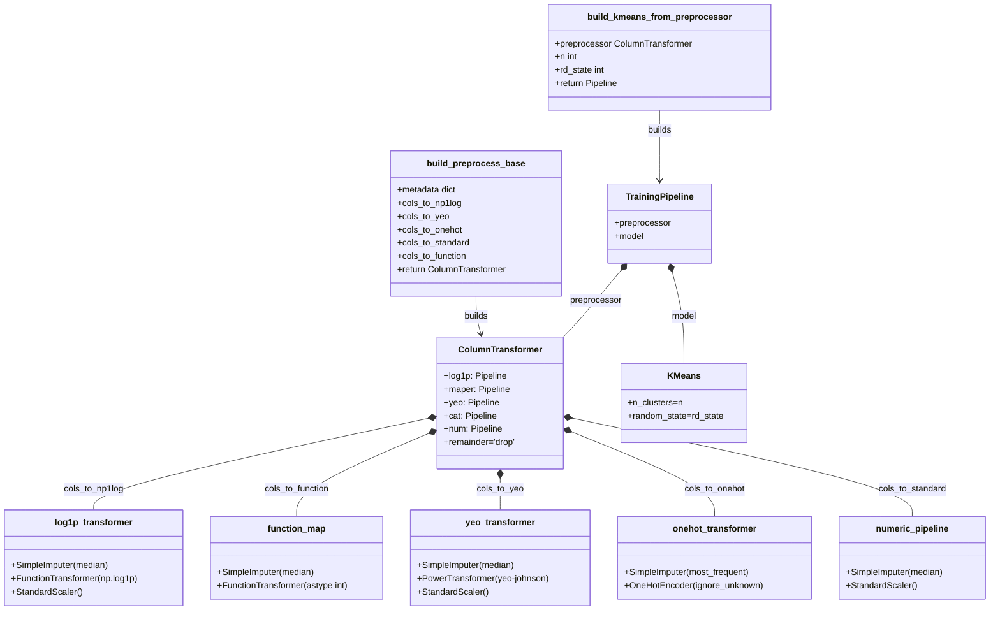

## Pipeline de Entrenamiento

Este pipeline descarga datos desde supabase con la libreria de python.
La data proveniente desde la base de datos se limpia y procesa sin ser agrupada en el primer proceso para evitar dataleakage se considera el agrupamiento como parte del Feature Engineering, esto se refleja en las funciones, también el sistema considera la agrupación de columnas para aplicar funciones de reducción de skewness automaticamente (aunque en esta versión no se almacena metadata como en repositorios personales, se puede documentar desde las funciones).

## Construir Clasificador de Agent/Crawlers desde Vercel Log Drains

La siguiente arquitectura considera que se tiene ya preparado un log drains en un formato tabular. En este caso se descarga desde Supabase bajo un esquema tabular descrito en el TABLE_README.MD

## Arquitectura de Entrenamiento

