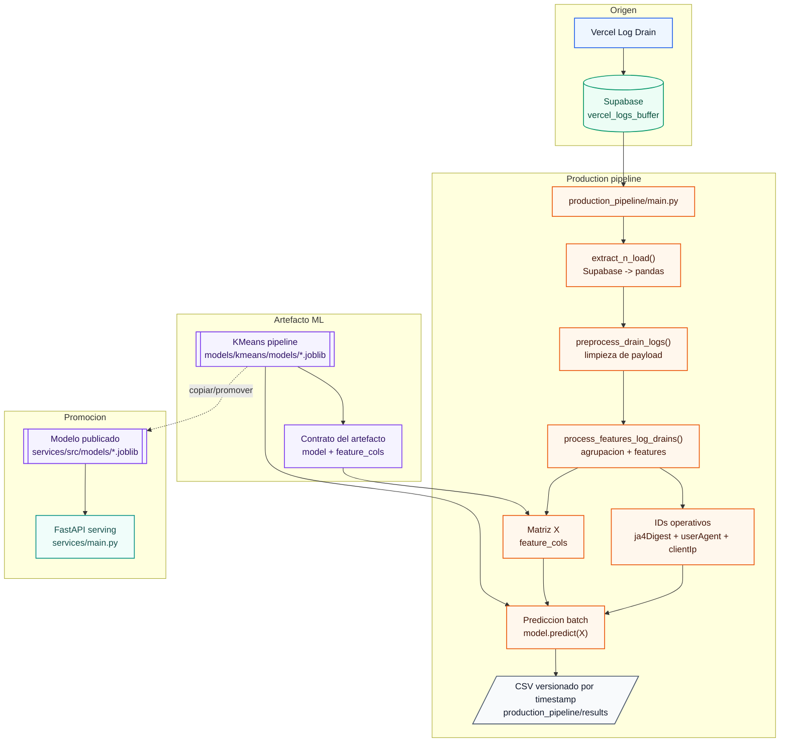
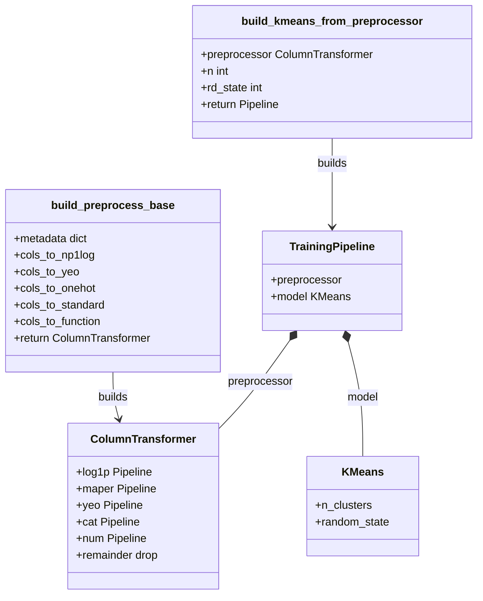

# PIDA Production Pipeline

Pipeline batch para transformar Vercel Log Drains en ventanas clasificadas de comportamiento de user agents.

Este modulo conecta con Supabase, extrae logs recientes desde `vercel_logs_buffer`, aplica limpieza y feature engineering, carga un artefacto `.joblib` entrenado previamente y genera un CSV con labels por combinacion de `ja4Digest`, `proxy.userAgent` y `proxy.clientIp`.

La idea central no es solo usar KMeans. El valor esta en todo lo que rodea al modelo: ingestion de logs reales, definicion de ventanas, features reproducibles, contrato de artefacto, resultados auditables y una ruta clara para promover el modelo hacia `services/`.

## Rol dentro del proyecto

`production_pipeline/` funciona como la capa batch del sistema.

En la version alpha publica, `production_pipeline/main.py` hace scoring de una ventana reciente usando un modelo existente. El entrenamiento del artefacto ocurre en el flujo de ML y produce un `.joblib` que despues puede ser usado por este pipeline y por el servicio FastAPI.

## Que hace

El flujo actual ejecuta:

1. Lee credenciales de Supabase desde variables de entorno.
2. Consulta registros recientes de `vercel_logs_buffer`.
3. Normaliza el campo `log` desde JSON hacia columnas tabulares.
4. Limpia columnas no usadas para el modelo.
5. Agrupa por `ja4Digest`, `proxy.userAgent` y `proxy.clientIp`.
6. Construye features de volumen, rutas y tiempo entre requests.
7. Carga el artefacto `.joblib` desde `models/kmeans/models`.
8. Usa `feature_cols` del artefacto para alinear columnas de inferencia.
9. Ejecuta prediccion de labels.
10. Guarda el resultado en `production_pipeline/results`.

## Arquitectura batch



## Entrada de datos

La fuente esperada es la tabla `vercel_logs_buffer` en Supabase.

La tabla funciona como buffer crudo de Vercel Log Drains: conserva el payload original en `log` y agrega columnas de control como `received_at`, `source`, `year`, `month`, `day`, `hour` y `compacted`.

El detalle de esta tabla esta documentado en:

```txt
production_pipeline/TABLE_README.MD
```

## Feature engineering

El pipeline trabaja por comportamiento agregado, no por request individual.

La agrupacion operativa usa:

| Columna | Rol |
| --- | --- |
| `ja4Digest` | Huella TLS/conexion util para separar patrones de agentes. |
| `proxy.userAgent` | User agent reportado por el cliente. |
| `proxy.clientIp` | IP del cliente observada en el log. |

Las features actuales incluyen:

| Feature | Descripcion |
| --- | --- |
| `conteo_requests` | Numero de requests por grupo. |
| `times_timestamp` | Conteo de timestamps observados. |
| `request_amount` | Conteo de request IDs. |
| `routes_visited` | Conteo de rutas visitadas. |
| `activity_window_ms` | Diferencia entre primer y ultimo timestamp del grupo. |
| `mean_time_between_requests_ms` | Columna heredada del resumen temporal; actualmente se calcula sobre diferencias entre timestamps. |
| `median_time_between_requests_ms` | Mediana de tiempo entre requests. |
| `is_one_shot` | Marca grupos con una sola request. |

Estas features intentan capturar volumen, dispersion temporal y repeticion de rutas. Eso permite separar visitas aisladas, navegacion ligera, bursts cortos y crawlers agresivos.

## Contrato del modelo

El pipeline espera un artefacto `.joblib` con al menos:

```python
{
    "model": modelo_entrenado,
    "feature_cols": columnas_usadas_en_training
}
```

En el flujo completo, el artefacto puede incluir mas metadata:

```python
{
    "model": modelo_entrenado,
    "metadata": metadata_preprocesamiento,
    "feature_cols": columnas_usadas_en_training,
    "drop_cols": columnas_excluidas,
    "id_cols": columnas_identificadoras,
    "n_clusters": 4,
    "created_at": timestamp,
    "model_name": "kmeans_vercel_drains",
    "description": "Pipeline entrenado para clasificar comportamiento de agentes desde Vercel Log Drains"
}
```

`feature_cols` es la parte mas importante del contrato: evita que el batch haga inferencia con columnas distintas a las usadas durante entrenamiento.

## Preprocesador del modelo

El entrenamiento usa un `ColumnTransformer` para aplicar transformaciones distintas segun el tipo de variable y su distribucion.



## Salida

Cada ejecucion genera un archivo:

```txt
production_pipeline/results/predicted_window_YYYY-MM-DD_HH-MM-SS.csv
```

La salida combina:

- IDs operativos: `ja4Digest`, `proxy.userAgent`, `proxy.clientIp`.
- Label asignada por el modelo.
- Features usadas para explicar la prediccion.

Ejemplo conceptual:

```csv
ja4Digest,proxy.userAgent,proxy.clientIp,label,conteo_requests,activity_window_ms,median_time_between_requests_ms,is_one_shot
...,Mozilla/5.0,...,2,49,44582656,2037,False
```

## Relacion con services

`production_pipeline/` genera evidencia batch y trabaja con el artefacto del modelo.

`services/` usa un modelo promovido a:

```txt
services/src/models/
```

La promocion del modelo todavia es manual en esta version alpha. El flujo esperado es:

1. Entrenar o actualizar el artefacto.
2. Validar resultados batch en `production_pipeline/results`.
3. Copiar/promover el `.joblib` aprobado hacia `services/src/models`.
4. Servir inferencia reciente desde FastAPI.

## Variables de entorno

```bash
SUPABASE_URL=
SUPABASE_KEY=
```

## Ejecutar

Desde la raiz del proyecto:

```bash
python production_pipeline/main.py
```

El script espera encontrar el modelo en:

```txt
models/kmeans/models/
```

## Limitaciones actuales

- El nombre del modelo esta fijo en `production_pipeline/main.py`.
- La ventana reciente depende de la funcion de carga configurada para Supabase.
- La promocion del modelo hacia `services/` es manual.
- Las labels son clusters no supervisados; su significado debe revisarse despues de cada reentrenamiento.
- Algunas columnas tecnicas y decisiones de feature engineering siguen en revision.

## Estado

Pipeline en etapa alpha. La prioridad actual es estabilizar el contrato entre datos, artefacto y servicio antes de automatizar versionado, seleccion de modelo y despliegue.
