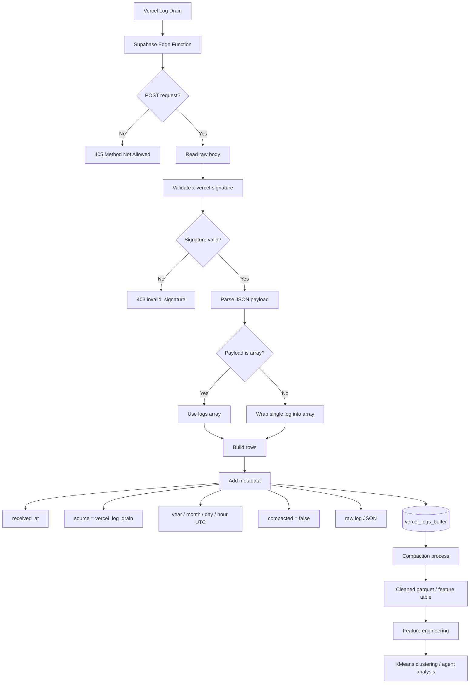

## Diseño de tabla: vercel_logs_buffer

La tabla vercel_logs_buffer funciona como una zona de aterrizaje cruda para los logs recibidos desde Vercel Log Drain.

Su objetivo principal es almacenar los eventos originales sin transformarlos todavía, conservando el payload completo en formato JSON y agregando columnas mínimas de control para facilitar particionado, compactación y procesamiento posterior.

### Propósito

Esta tabla está diseñada para recibir logs en tiempo casi real desde una Edge Function de Supabase. Cada request válido enviado por Vercel se inserta como una o varias filas, dependiendo de si el payload recibido contiene un único log o un arreglo de logs.

La tabla no busca modelar todavía el comportamiento del usuario, agente o crawler. Su función es actuar como buffer operacional antes de pasar a etapas posteriores de limpieza, compactación, feature engineering y entrenamiento.

### Estructura conceptual

| Columna     |          Tipo esperado | Descripción                                                            |
| ----------- | ---------------------: | ---------------------------------------------------------------------- |
| received_at | timestamptz / text ISO | Fecha y hora en que Supabase recibió el lote de logs.                  |
| source      |                   text | Identificador de la fuente del evento. En este caso: vercel_log_drain. |
| year        |                integer | Año UTC calculado al momento de recepción.                             |
| month       |                integer | Mes UTC calculado al momento de recepción.                             |
| day         |                integer | Día UTC calculado al momento de recepción.                             |
| hour        |                integer | Hora UTC calculada al momento de recepción.                            |
| log         |                  jsonb | Payload original del log enviado por Vercel.                           |
| compacted   |                boolean | Bandera para indicar si el registro ya fue procesado o compactado.     |

### Decisiones de diseño

La tabla separa columnas de control de los datos crudos. Las columnas year, month, day y hour permiten trabajar por ventanas temporales sin tener que parsear todo el JSON en cada consulta.

El campo log conserva el evento original completo, lo que permite reconstruir o modificar el proceso de extracción de features sin perder información histórica.

La columna compacted permite distinguir entre registros crudos pendientes de procesamiento y registros que ya fueron consumidos por una etapa posterior del pipeline.

### Flujo esperado

1. Vercel envía uno o varios logs a la Edge Function.
2. La función valida método POST.
3. La función valida la firma HMAC SHA-1 usando VERCEL_DRAIN_SIGNATURE_SECRET.
4. El cuerpo recibido se parsea como JSON.
5. Si el payload es un arreglo, se inserta cada log como una fila.
6. Si el payload es un objeto único, se normaliza a un arreglo de un elemento.
7. Cada fila se guarda con metadatos temporales UTC.
8. Los registros quedan marcados como compacted = false.
9. Un proceso posterior puede leer, transformar, compactar y marcar los registros como procesados.

### Rol dentro del pipeline

vercel_logs_buffer representa la primera capa del sistema de datos:

Vercel Log Drain
↓
Supabase Edge Function
↓
vercel_logs_buffer
↓
compactación / limpieza
↓
feature engineering
↓
modelo de clustering / análisis de agentes

Esta separación permite mantener el sistema auditable, reproducible y tolerante a cambios futuros en la lógica de procesamiento.

