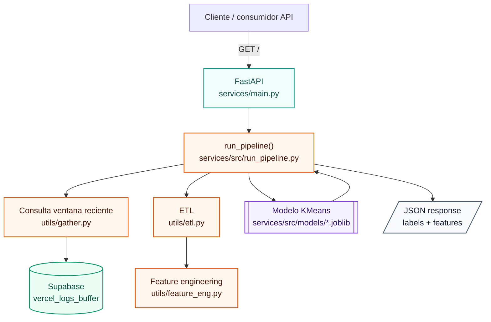

# Log-Hound Services

Servicio de inferencia para clasificar comportamiento de user agents a partir de Vercel Log Drains almacenados en Supabase.

Este modulo expone un endpoint con FastAPI que consulta logs recientes, aplica el mismo feature engineering usado durante entrenamiento, carga un artefacto `.joblib` previamente entrenado y devuelve las etiquetas generadas por el modelo.

## Que hace

`services/main.py` levanta una API con FastAPI.

Actualmente el endpoint principal ejecuta `run_pipeline()` y realiza el siguiente flujo:

1. Consulta registros recientes desde Supabase.
2. Normaliza el payload de logs.
3. Limpia columnas no usadas.
4. Construye features por combinacion de `ja4Digest`, `proxy.userAgent` y `proxy.clientIp`.
5. Carga el modelo entrenado desde `services/src/models`.
6. Ejecuta prediccion.
7. Devuelve una respuesta JSON con las labels generadas.

## Arquitectura interna



## Modelo

El servicio no entrena modelos.

El modelo debe existir previamente en:

```txt
services/src/models/
```

El artefacto esperado es un `.joblib` que contiene al menos:

```python
{
    "model": modelo_entrenado,
    "feature_cols": columnas_usadas_en_training
}
```

`feature_cols` es importante porque evita que el servicio haga inferencia con columnas distintas a las usadas durante entrenamiento.

## Variables de entorno

El servicio requiere credenciales de Supabase:

```bash
SUPABASE_URL=
SUPABASE_KEY=
```

## Endpoint actual

### `GET /`

Ejecuta inferencia sobre la ventana reciente de logs y devuelve una lista de registros en formato JSON.

Respuesta conceptual:

```json
[
  {
    "ja4Digest": "...",
    "proxy.userAgent": "...",
    "proxy.clientIp": "...",
    "label": 2,
    "conteo_requests": 49,
    "activity_window_ms": 44582656,
    "median_time_between_requests_ms": 2037
  }
]
```

## Ventana de inferencia

Actualmente el servicio consulta logs recientes desde Supabase usando una ventana de 10 minutos.

Esta decision esta pensada para detectar comportamiento operativo cercano al tiempo real, especialmente agentes que concentran muchas requests en periodos cortos.

## Limitaciones actuales

- El endpoint aun no tiene autenticacion.
- El modelo se carga desde una ruta fija.
- La promocion del modelo hacia `services/src/models` todavia es manual.
- Algunas features tecnicas siguen en revision.
- Las labels son clusters no supervisados, no categorias definitivas.
- El significado de cada label puede cambiar despues de reentrenar.

## Flujo esperado de uso

1. Entrenar o actualizar el modelo desde el pipeline de produccion.
2. Copiar/promover el `.joblib` resultante hacia `services/src/models`.
3. Levantar el servicio FastAPI.
4. Consultar `GET /`.
5. Usar las labels para analisis, monitoreo o decisiones de firewall/cache.

## Ejecutar localmente

Desde la raiz del proyecto:

```bash
uvicorn services.main:app --reload
```

Dependiendo del entorno de ejecucion, puede ser necesario ajustar el `PYTHONPATH` o ejecutar desde la carpeta `services`.

## Estado

Servicio en etapa alpha. La prioridad actual es validar el flujo completo de inferencia antes de endurecer seguridad, versionado de modelos y despliegue.
