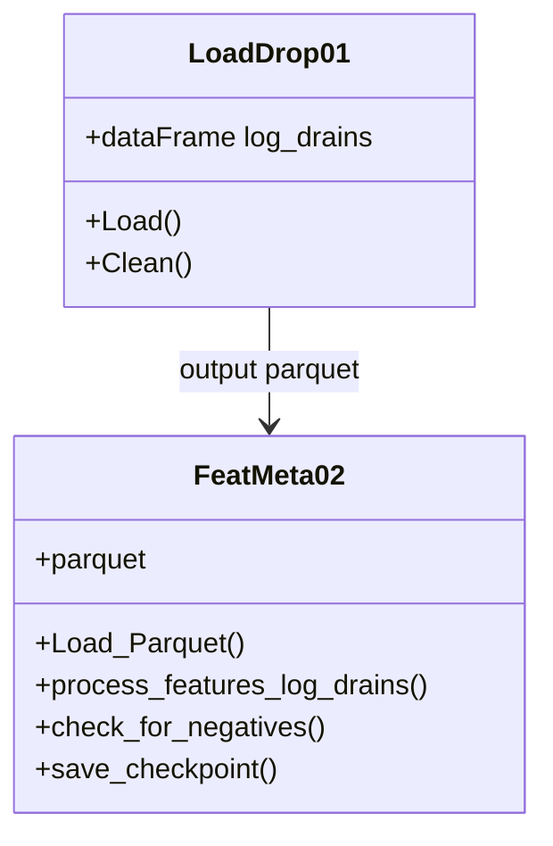

# Notas de Build

```mermaid
classDiagram
    class LoadDrop01 {
        +dataFrame log_drains
        +Load()
        +Clean()
    }

    class FeatMeta02 {
        +parquet
        +Load_Parquet()
        +process_features_log_drains()
        +check_for_negatives()
        +save_checkpoint()
    }

    LoadDrop01 --> FeatMeta02 : output parquet
```
