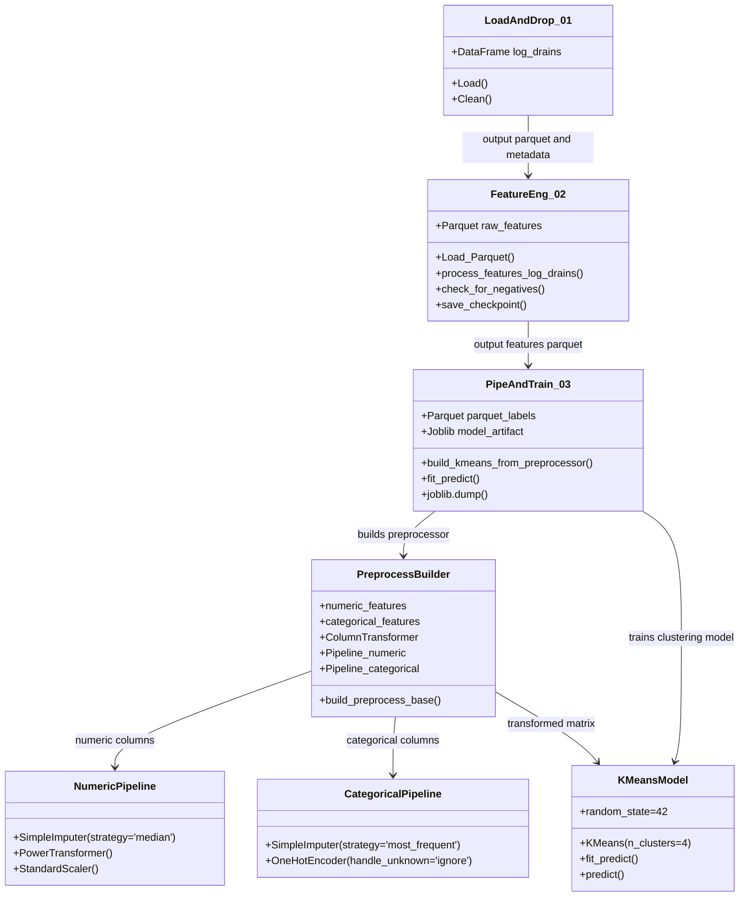

# Notas de Build

```mermaid
classDiagram
    class LoadAndDrop_01 {
        +DataFrame log_drains
        +Load()
        +Clean()
    }

    class FeatureEng_02 {
        +Parquet raw_features
        +Load_Parquet()
        +process_features_log_drains()
        +check_for_negatives()
        +save_checkpoint()
    }

    class PipeAndTrain_03 {
        +Parquet parquet_labels
        +Joblib model_artifact
        +build_kmeans_from_preprocessor()
        +fit_predict()
        +joblib.dump()
    }

    class PreprocessBuilder {
        +numeric_features
        +categorical_features
        +build_preprocess_base()
        +ColumnTransformer
        +Pipeline_numeric
        +Pipeline_categorical
    }

    class NumericPipeline {
        +SimpleImputer(strategy='median')
        +PowerTransformer()
        +StandardScaler()
    }

    class CategoricalPipeline {
        +SimpleImputer(strategy='most_frequent')
        +OneHotEncoder(handle_unknown='ignore')
    }

    class KMeansModel {
        +KMeans(n_clusters=4)
        +random_state=42
        +fit_predict()
        +predict()
    }

    LoadAndDrop_01 --> FeatureEng_02 : output parquet and metadata
    FeatureEng_02 --> PipeAndTrain_03 : output features parquet
    PipeAndTrain_03 --> PreprocessBuilder : builds preprocessor
    PreprocessBuilder --> NumericPipeline : numeric columns
    PreprocessBuilder --> CategoricalPipeline : categorical columns
    PipeAndTrain_03 --> KMeansModel : trains clustering model
    PreprocessBuilder --> KMeansModel : transformed matrix
```
