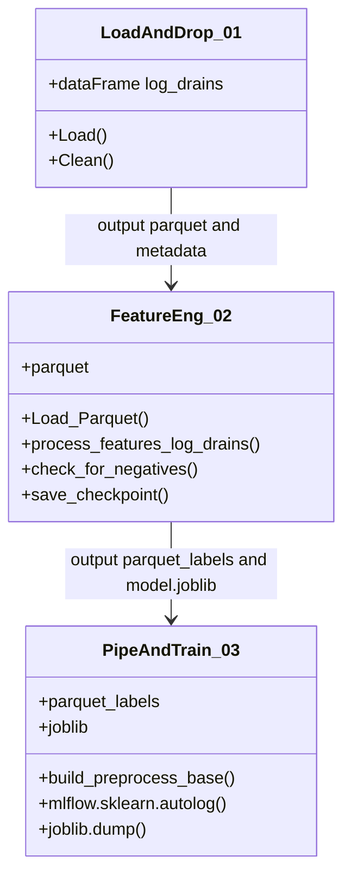

# Notas de Build

```mermaid
classDiagram
    class LoadAndDrop_01 {
        +dataFrame log_drains
        +Load()
        +Clean()
    }

    class FeatureEng_02 {
        +parquet
        +Load_Parquet()
        +process_features_log_drains()
        +check_for_negatives()
        +save_checkpoint()
    }

    class PipeAndTrain_03 {
        +parquet_labels
        +joblib
        +build_preprocess_base()
        +mlflow.sklearn.autolog()
        +joblib.dump()
    }

    LoadAndDrop_01 --> FeatureEng_02 : output parquet and metadata
    FeatureEng_02 --> PipeAndTrain_03 : output parquet_labels and model.joblib
```
